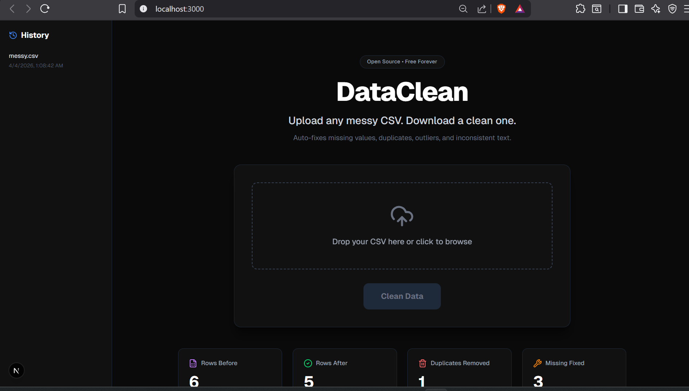

# DataClean 🧹

> Upload any messy CSV. Download a clean one.

Stop wasting hours manually cleaning data before training your ML models. DataClean automatically detects and fixes every common data quality issue and gives you a visual before/after report showing exactly what changed.



---

## What Gets Fixed

| Issue | Fix Applied |
|-------|------------|
| Duplicate rows | Detected and removed automatically |
| Missing numeric values | Filled with column median |
| Missing categorical values | Filled with column mode |
| Outliers | Capped using IQR bounds |
| Inconsistent text | Whitespace stripped and lowercased |

---

## Features

- **Real-time progress** via WebSockets — watch each cleaning step live
- **Visual before/after charts** — see exactly what changed per column
- **AI cleaning report** — plain English explanation of every fix applied
- **Download cleaned CSV** — one click, clean file ready for training
- **Session history** — every past cleaning session saved to Supabase
- **Redis caching** — same file cleaned twice returns instantly

---

## Tech Stack

| Layer | Technology |
|-------|-----------|
| Frontend | Next.js 14 + TypeScript |
| Styling | Tailwind CSS |
| Charts | Recharts |
| Backend | Python FastAPI |
| Data Processing | Pandas + NumPy |
| AI | Groq llama-3.1-8b-instant |
| Database | Supabase (PostgreSQL) |
| Cache | Upstash Redis |
| Realtime | WebSockets |

---

## How It Works

1. Upload any CSV file
2. DataClean reads the file and sends it to the Python backend via WebSocket
3. Backend checks Redis cache first — if same file was cleaned before returns instantly
4. If cache miss runs the full cleaning pipeline
5. Removes duplicate rows
6. Fills missing numeric values with column median
7. Fills missing categorical values with column mode
8. Caps outliers using IQR bounds
9. Strips whitespace and lowercases text columns
10. Generates a before/after comparison report
11. Generates an AI plain English summary via Groq
12. Saves session to Supabase
13. Returns cleaned CSV as downloadable file

---

## Outlier Detection

DataClean uses the IQR method to detect and cap outliers.

Q1 = 25th percentile. Q3 = 75th percentile. IQR = Q3 - Q1. Lower bound = Q1 - 1.5 x IQR. Upper bound = Q3 + 1.5 x IQR. Values outside bounds are capped to the bound value.

---

## Project Structure
```
DataClean/
├── app/
│   ├── page.tsx
│   ├── layout.tsx
│   └── globals.css
├── dataclean-api/
│   ├── main.py
│   ├── requirements.txt
│   └── .env
├── .env.local
└── README.md
```

---

## Getting Started

### Prerequisites

- Node.js 18+
- Python 3.10 to 3.13
- Groq API key — free at console.groq.com
- Supabase project — free at supabase.com
- Upstash Redis — free at upstash.com

### Installation

Clone the repo and install dependencies:
```
git clone https://github.com/avikcodes/DataClean
cd DataClean
npm install
cd dataclean-api
pip install -r requirements.txt
```

### Environment Variables

Create dataclean-api/.env with:
```
GROQ_API_KEY=your_key
SUPABASE_URL=your_url
SUPABASE_KEY=your_anon_key
UPSTASH_REDIS_REST_URL=your_url
UPSTASH_REDIS_REST_TOKEN=your_token
```

Create .env.local in root with:
```
NEXT_PUBLIC_SUPABASE_URL=your_url
NEXT_PUBLIC_SUPABASE_ANON_KEY=your_anon_key
```

### Run

Terminal 1:
```
cd dataclean-api
uvicorn main:app --reload
```

Terminal 2:
```
npm run dev
```

Open http://localhost:3000

---

## Database Schema
```
create table cleaning_sessions (
  id uuid default gen_random_uuid() primary key,
  session_id text not null,
  file_name text not null,
  original_rows int,
  cleaned_rows int,
  changes_made jsonb,
  ai_report text,
  created_at timestamp default now()
);
```

---

## Roadmap

- [x] Duplicate removal
- [x] Missing value imputation
- [x] Outlier capping
- [x] Text normalization
- [x] Real-time WebSocket progress
- [x] Before/after visual comparison
- [x] Redis caching
- [x] Supabase history
- [x] AI cleaning report
- [x] Download cleaned CSV
- [ ] Excel file support
- [ ] Custom cleaning rules
- [ ] PDF report export
- [ ] API access

---

## Part of 30 Projects

This is **Project 5 of 30** in my open-source build sprint — building 30 open-source AI and ML tools from March to December 2026.

Follow on X: [@Avikzx](https://x.com/Avikzx)

All projects: [github.com/avikcodes](https://github.com/avikcodes)

---

## License

MIT
